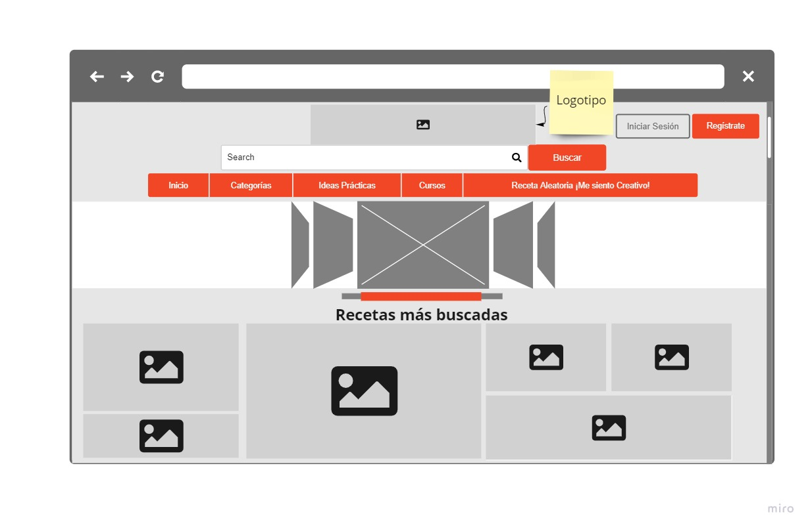
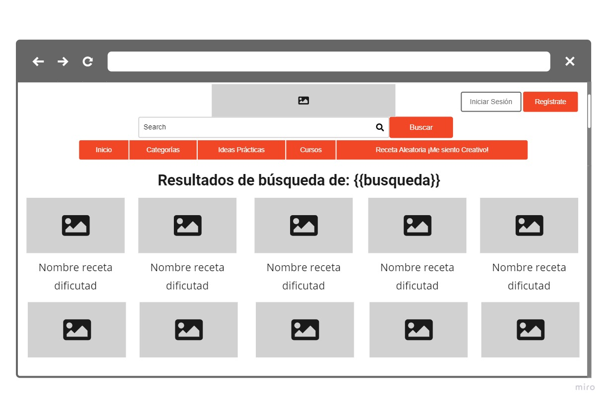
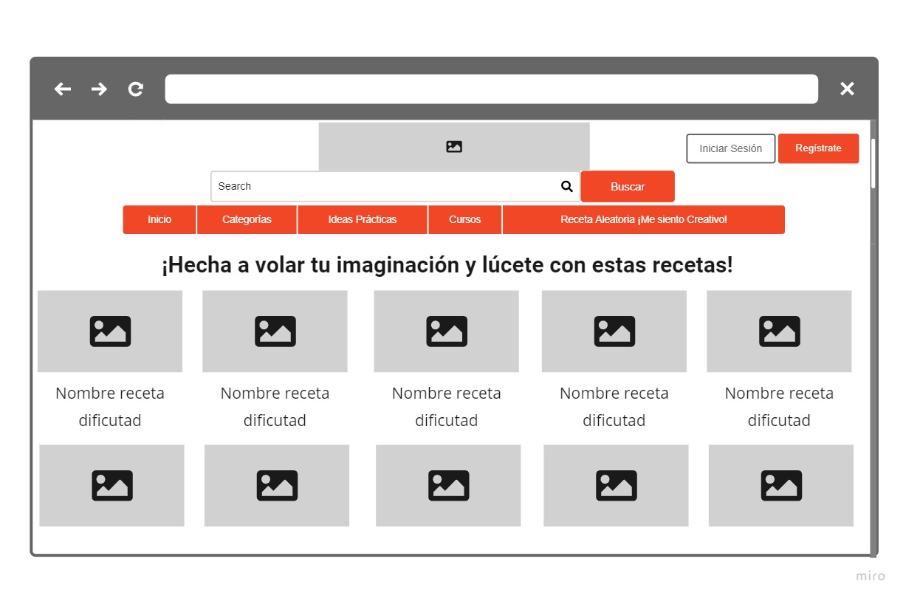
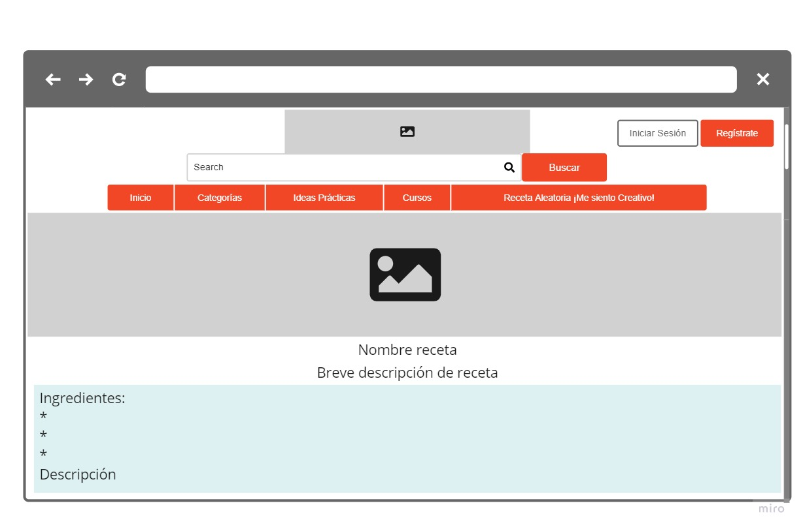

# Fase 2 | Proyecto final| Equipo 16

En este documento se encuentra el desarrollo del Proyecto final, el cual está dividido en dos entregables, uno realizado en el Postwork de la sesión 8 y el otro en el Postwork de la sesión 12.

El proyecto consiste en el desarrollo de una aplicación cuya función es un buscador de recetas. Sus especificaciones son:
- Mostrar en la UI un input para ingresar texto y un botón para generar la búsqueda.
- Utilizar la siguiente API para obtener los resultados: [TheMealDB](https://www.themealdb.com/api.php).
- Mostrar los resultados usando las imágenes de las recetas.
- Al seleccionar una imagen se deben desplegar los detalles de la receta, es decir, los ingredientes y las instrucciones.
- Mostrar en la UI un botón secundario para desplegar una receta aleatoria.


## Contenido :clipboard:

- Postwork S8
	- [Mockups](#mockups)
	- [Configuración del proyecto](#configuración-del-proyecto)


## Postwork S8

### Mockups

A continuación se presenta la propuesta de UI a través de mockups realizados con la aplicación [miro](https://miro.com/app/dashboard/), esto con el fin de obtener una idea clara de todos los componentes que serán contemplados para el desarrollo del proyecto.

**Mockup 1:** Pantalla de inicio 



**Mockup 2:** Pantalla de resultados de una búsqueda



**Mockup 3:** Pantalla de Recetas Aleatorias 



**Mockup 4:** Pantalla de Receta Específica 



### Configuración del proyecto
Para la configuración del proyecto se dividió en tres tareas principales:
1. Instalar y configurar **Webpack, Babel y Webpack Dev Server**.
2. Configurar los **loaders** necesarios para los estilos, se puede utilizar CSS o SASS.
3. Instalar las **librerías** que se vayan a utilizar (Bootstrap, Materialize, Foundation, etc.).

Para la instalación y configuración de Webpack, Babel y Webpack Dev Server fue necesario instalar las dependencias de cada una de estas herramientas, las cuales fueron:
  - ```webpack, webpack-cli y html-webpack-plugin```,  dependencias de Webpack.
  - ```webpack-dev-server```, dependencia de Webpack Dev Server.
  - ```@babel/core @babel/preset-env babel-loader```, dependencias de Babel.


Se realizó la configuración de webpack en el archivo ```webpack.config.js```:

```javascript
const path = require('path');
const HtmlWebpackPlugin = require('html-webpack-plugin');

module.exports = {
    entry: './src/js/index.js',
    output: {
        path: path.resolve(__dirname, 'dist'),
        filename: 'bundle.js'
    },
    plugins: [
        new HtmlWebpackPlugin({
            filename: 'index.html',
            template: './src/index.html'
        })
    ],
    devServer: {
        contentBase: path.resolve(__dirname, 'dist')
    }
}
```

En el archivo ```package.json``` se defineron dos scripts para el uso de webpack:

- ```npm run buid```: Comando para correr el script ``` "build": "webpack --mode production"``` definido en package.json

 - ```npm run start```: Comando para correr el script ```"start": "webpack serve --mode development --open"``` definido en package.json, el cual inicia webpack dev server.

Se creó un nuevo archivo llamado ```babel.config.json```, en donde configuramos babel y le indicamos el preset que debe usar.

```javascript
{
  "presets": ["@babel/preset-env"]
}
```

Como segundo punto,se instalaron y configuraron los loaders necesarios para poder interpretar los archivos css del proyecto.
Los loaders requeridos fueron ```style-loader``` y ```css-loader```.

Una vez instalados, se agregó al archivo ```webpack.config.js``` la configuración corrspondiente:

```javascript
module: {
    rules: [
      { test: /\.css$/, use: ['style-loader', 'css-loader'] },
    ]
  
```

Por último, se hizo la instalación de librerías que van a ser utilizadas en el desarrollo del proyecto, en este caso se hace uso de *Bootstrap*.

Las dependencias instaladas fueron ```bootstrap``` y  ```@popperjs/core```.

Como parte de la configuración de Bootstrap se incluyó en el archivo index.js los import correspondientes: 

```javascript
import 'bootstrap/dist/css/bootstrap.min.css';
import 'bootstrap';
```
